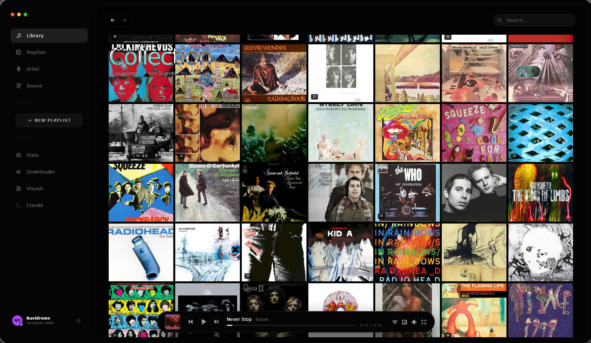
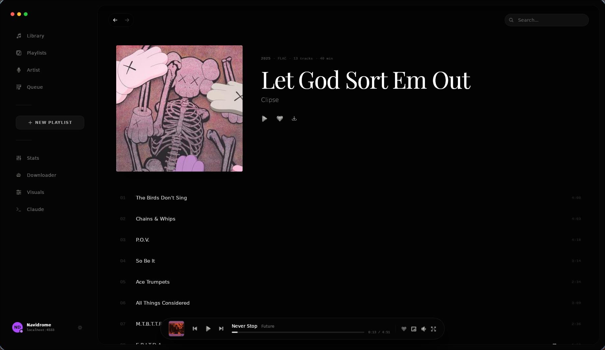
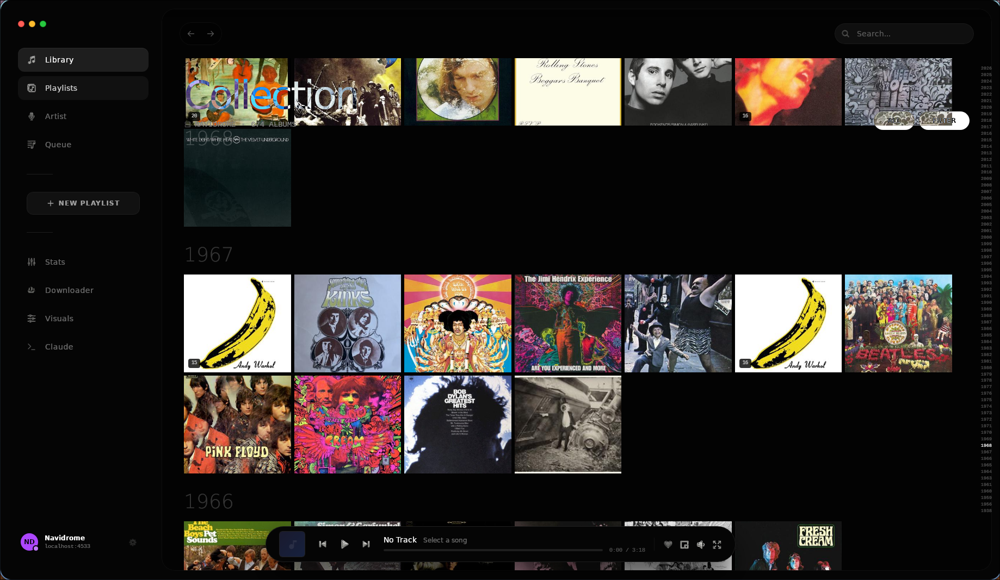
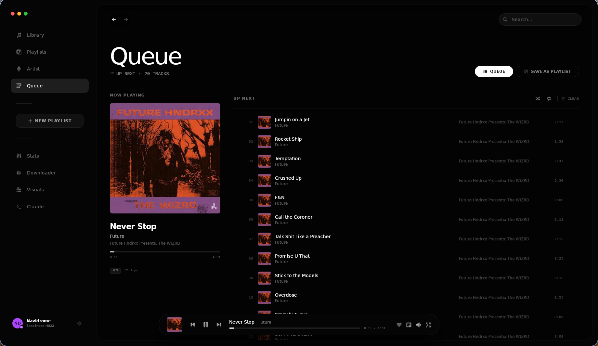
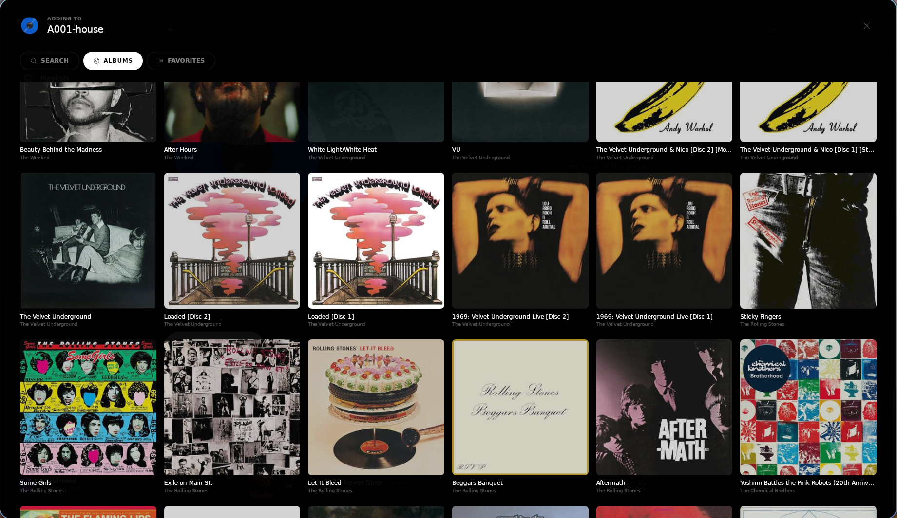

<p align="center">
  
</p>
<h1 align="center">GuteMusik</h1>

<p align="center">A fast, cross-platform desktop music player for Subsonic servers.</p>

---

## About

GuteMusik connects to Navidrome, Airsonic, Gonic, or any other Subsonic-compatible server. React and TypeScript on the frontend, Rust audio engine, Tauri underneath (NO ELECTRON).

## Features

- Browse by album, artist, playlist, or chronologically
- Native playback of FLAC, MP3, AAC, and more via Rust. You can also listen to local files
- Full-screen player with album art and lyrics, and mini player that pops out with queue/lyrics toggle
- Search across your whole collection and view it in one doom scroll, and export your library to make a cool poster like the one shown below
- Queue management, favorites, starred albums, the works
- Easy playlist creation and editing, synced to your server
- Plugin system for custom components and rust extensions. In the screenshots, anything below the new playlist button is a plugin

### Collection



### Album View



### Temporal Filter



### Queue



### Add to Playlist



## Install

GuteMusik is in alpha. Builds for Linux, macOS, and Windows (most likely, I don't have any windows machine to test on).

You need a running Subsonic-compatible server. I have a pre configured dockerfile [here](https://github.com/MaxwellIsaacs/gutemusik/extras/navidrome_docker) if you don't have one and want to roll your own very quickly. 

### macOS

Grab the `.dmg` from the [releases page](https://github.com/MaxwellIsaacs/gutemusik/releases).

### From Source

```bash
git clone https://github.com/MaxwellIsaacs/gutemusik.git
cd gutemusik
npm install
npm run tauri:dev
```
*If you are on NixOS, there is a flake.nix [here](https://github.com/MaxwellIsaacs/gutemusik/nix/flake.nix)*
### Production Build

```bash
npm run tauri:build
```

## Setup

Open GuteMusik, go to Settings, enter your server URL and credentials, and you are good to go.

## Stack

| Layer | Technology |
|-------|-----------|
| Frontend | React 19, TypeScript, TailwindCSS, Vite |
| Backend | Rust, Tauri 2.x |
| Audio | rodio, symphonia |
| API | Subsonic API v1.16.1 |

## Plugins

Plugins can be written in TypeScript (frontend) or Rust (backend). API still stabilizing.

## Contributing

Contributions welcome. Open an issue first for anything beyond bug fixes.

## License

MIT
